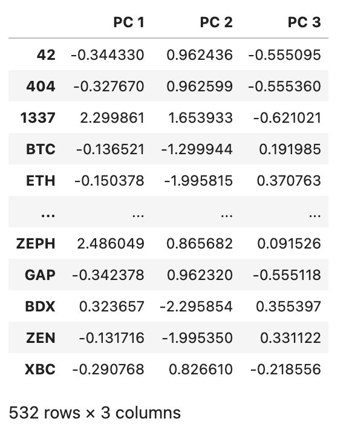
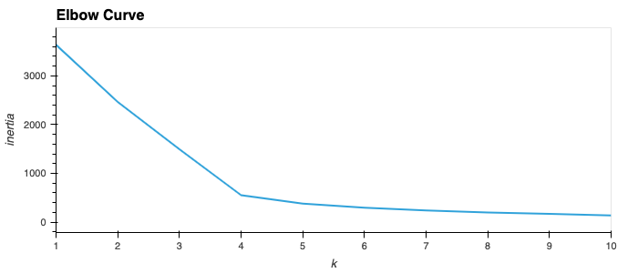
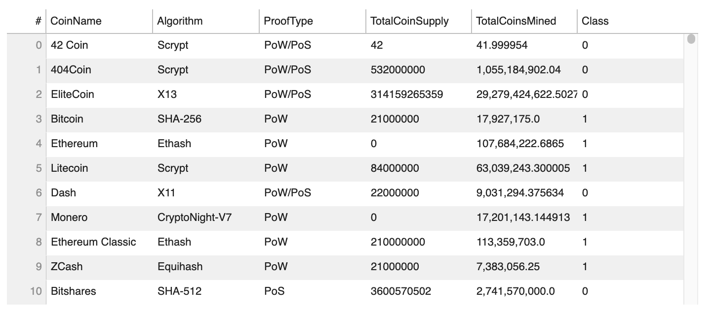
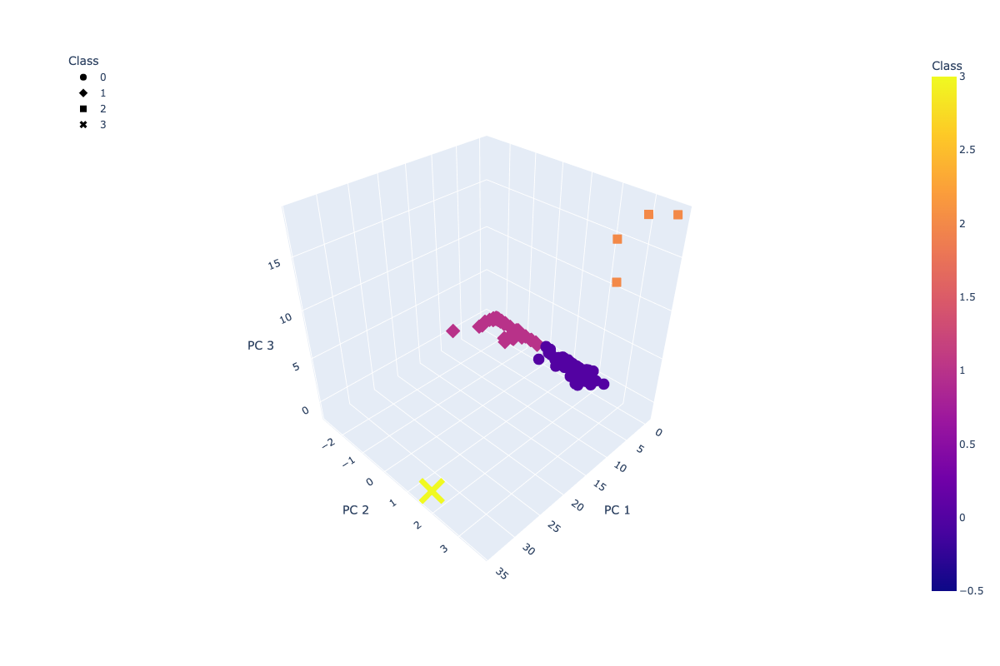
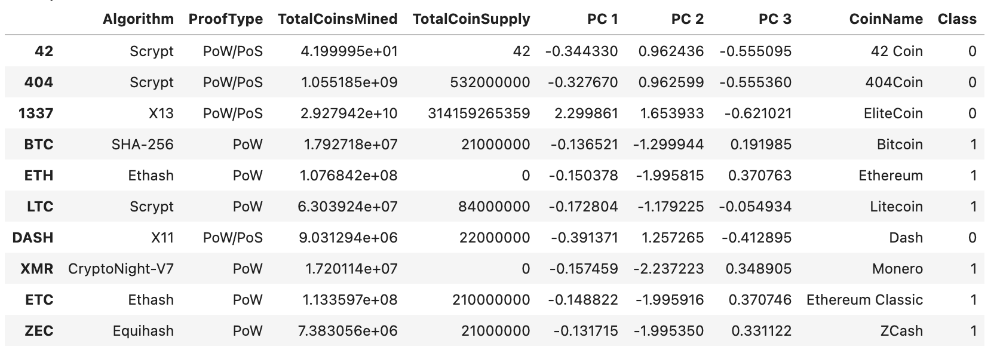
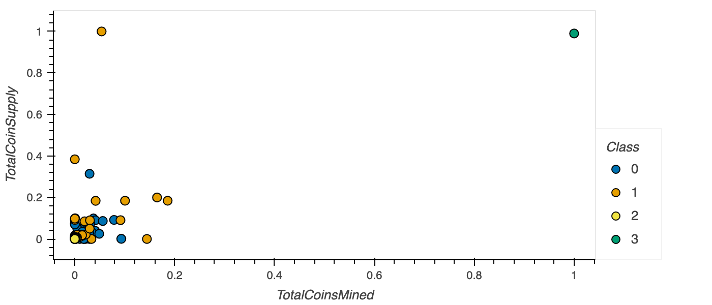

# Cryptocurrencies

## Overview

This project used unsupervised machine learning to find relationships between the various cryptocurrencies being currently traded.  A dataset downloaded from [CryptoCompare]("https://min-api.cryptocompare.com/data/all/coinlist") was used to provide the data for the analysis which included the number of coin supply and amount mined as well as the currency algorithm and proof type used for each cryptocurrency.  The goal was to determine if there are any similarities across the wide number of cryptocurrencies to give insight for investors to gain insight into this new market.  The analysis was completed using principal component analysis (PCA) using the K-means algorithm to build clusters of the various cryptocurrencies based on the data described above using [code]("https://github.com/wattsr1/Cryptocurrencies/blob/main/crypto_clustering.ipynb") developed using Jupyter Notebook with the SKLearn module.  The results were then visualized to show the results of the analysis to find the relationships calculated during the analysis.

---

## Results

### Data Cleaning

The initial dataset was cleaned to ensure that it was suitable for the analysis and would provide valuable insight.  The first was to remove any cryptocurrencies that were not traded and with coins being mined.  The removed values that would not be improved the quality of the analysis.  Next cryptocurrency names were removed and saved in another dataframe to be used for the final visualization.  The columns containing the algorithm and proof types were string values which could not be used, so they were transformed using get_dummies() method to provide numeric binary code for each algorithm and proof type.  Finally, the data was scaled using StandardScaler to reduce the variation in the size of the number across the dataset.

### Data Reducing

The dataset created after the cleaning was reduced using the PCA algorithm to reduce the dimensions for the dataframe to 3.  These principal components created by PCA provides 3 dimensions which could describe each of the cryptocurrencies based on the data provided.  This data was stored in a new dataframe linked to the index containing the code for each cryptocurrency being analyzed.

### Clustering

The final step was to cluster each of the cryptocurrencies based on the PCA principal components developed in the previous step.  To determine the appropriate number of clusters to be assigned to the data, an elbow curve was created using the PCA results to determine the location where the changes to the y-axis becomes less significant.  As seen in the graph below the curve begins to plateau after the x value of 4 which is used to determine the number of clusters to be applied to the PCA data.  These classes are applied to the PCA data using the K-means algorithm to cluster the cryptocurrencies and provide a class value for each. This data was added to the other data to create a new dataframe summarizing the complete dataset.

### Data Visualization

With the clustering complete was possible to visualize the classes assigned to each cryptocurrency based on the classes created using the K-means algorithm and the principal components from the PCA.  This was visualized in a 3d scatter plot to visualize the 4 clusters of cryptocurrency developed in the analysis.  The graph shows how cryptocurrencies could be grouped based on the data provided for each and how tightly, or loosely they are grouped.  The data used for this analysis was collected in a table that contained the relevant data and classes for each cryptocurrency in the study.  Finally, the total mined and coin supply data was transformed using a scaler between 0 and 1 to be used to visualize the relationship between these two features in a scatter plot graph seen below.

---

## Summary

Unsupervised machine learning provides a method to group and cluster like objects based on data that provides some insight into the characteristics of each object.  Unlike supervised machine learning the specific characteristics are not clearly defined and show how different objects can be related.  With complex datasets this method can give some way to group data for use in classification or for further analysis to find relationships of factors of interest using other analytic methods.  This dataset provided some clear grouping of cryptocurrencies currently being traded however this method does not define what characteristics make the relationships possible.  This data set can be used to group and classify cryptocurrencies and may provide some insight for new cryptocurrencies that are introduced to determine how they relate to current cryptocurrencies being traded.

---
